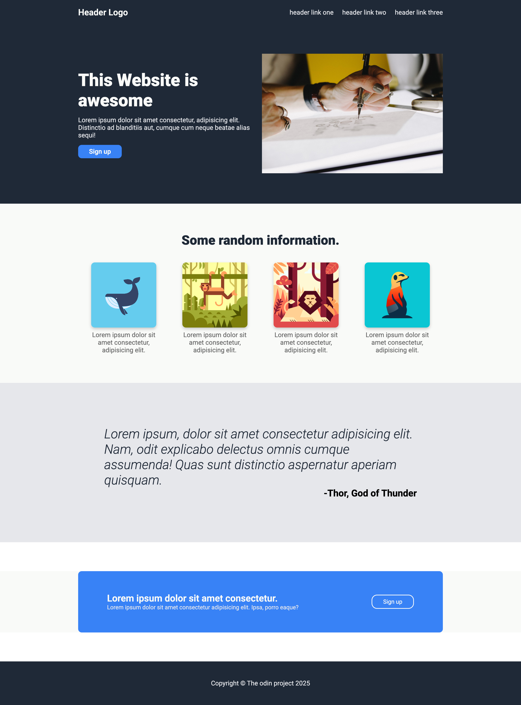

# Flex Website

This is an exercise from The Odin Project. A simple and responsive website built with HTML and CSS, featuring a clean and modern flexbox-based layout.

## Technologies Used
- HTML5
- CSS3

## Live Demo
[View it here](https://skylaryhu.github.io/odin-flex/)

## Screenshot

